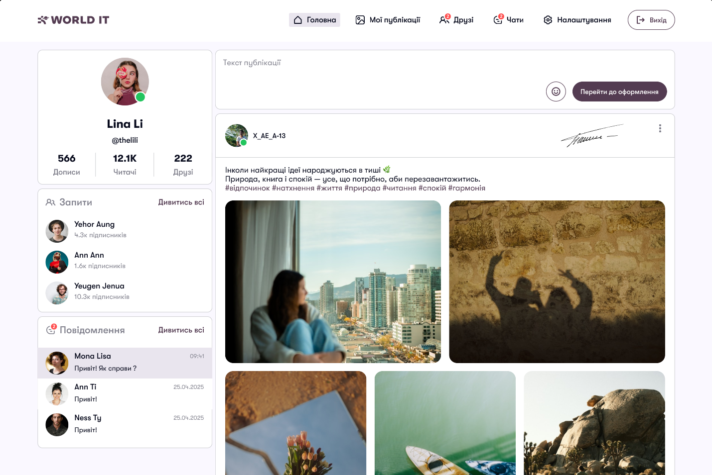
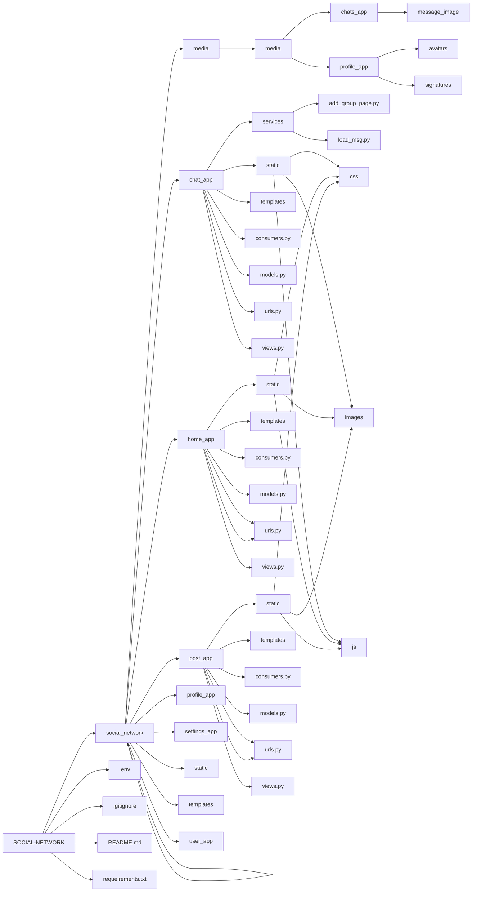
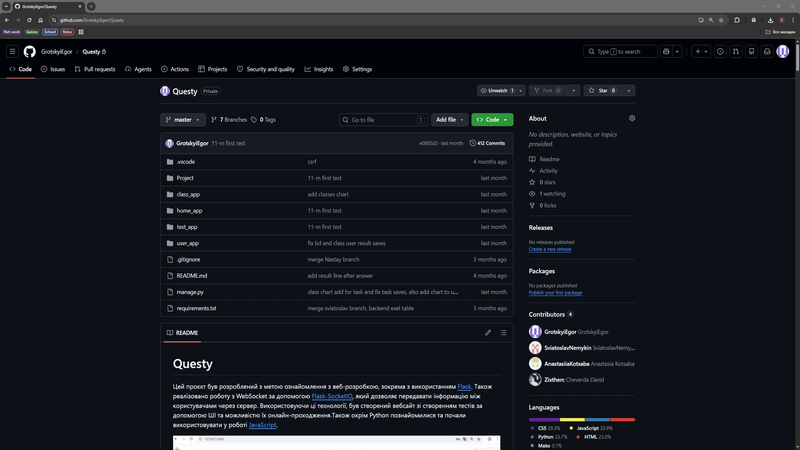
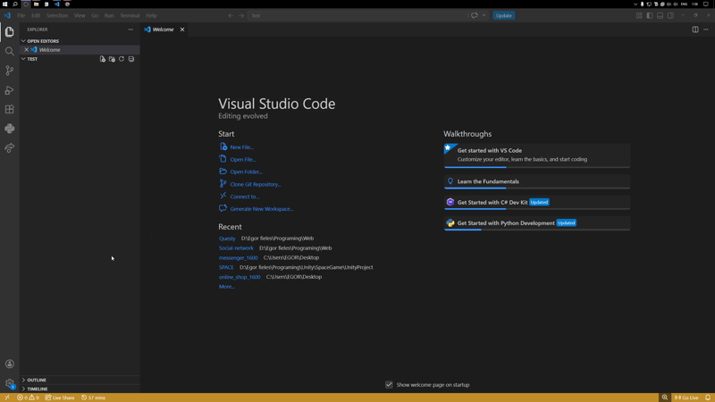
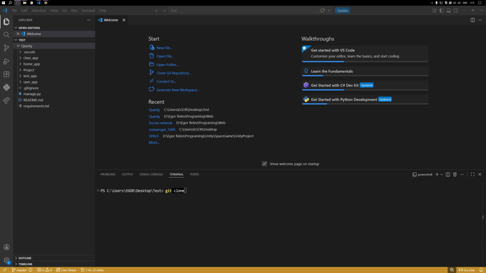
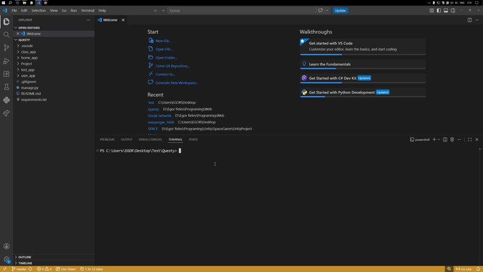
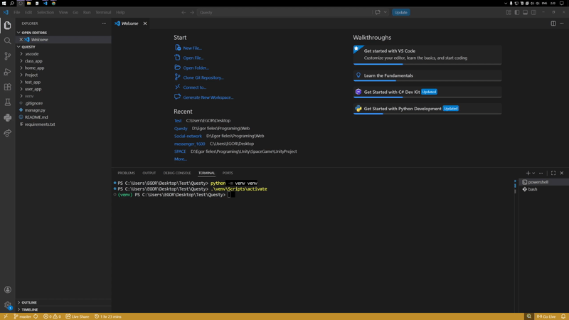
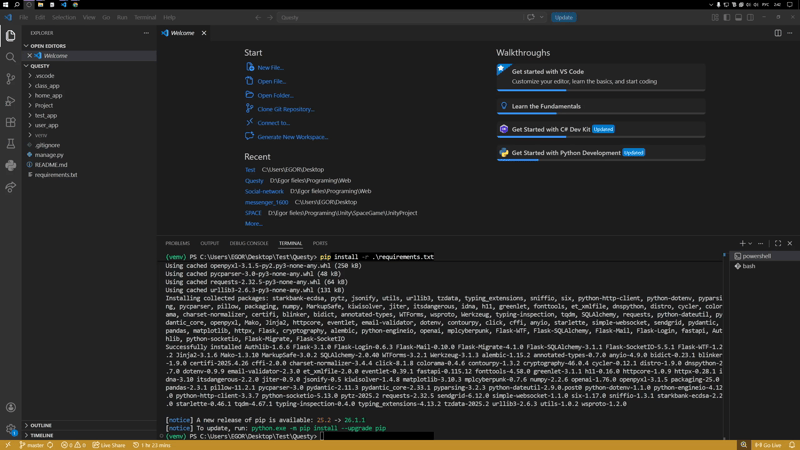

<div align="center">

<br>

<br>
<br>

<h1>Social network</h1>

<div align="center">

<a href="https://github.com/yourname/questy">
  <span style="font-size: 18px;"><b>Перегляньте документи »</b></span>
</a>

<details>
  <summary style="font-style: italic; font-size: 14px;">English translation</summary>
  <a href="https://github.com/yourname/questy">
    <span style="font-size: 18px;"><b>View the documents »</b></span>
  </a>
</details>
<br>

</div>

<h3>Соціальна мережа створена на Django, за допомогою веб-сокетів.</h3>

<p style="font-size: 16px;"> 
    Вебзастосунок для соціальної мережі, яка дозволить опрацювати такі модулі як Django, асинхронні фреймворки. Закріплення отриманих знань під час навчання на третьому курсі, та здобування знань у сфері веб-розробки.
</p>

<p style="font-size: 14px;"> 
    Гроцький Егор - https://github.com/GrotskyiEgor
    Денис Аверкін https://github.com/denaverkin
    Щурик Давид https://github.com/ShchurikDavid
    Федотов Микита https://github.com/FedotovNikita993
</p>

<details>
  <summary style="font-style: italic; font-size: 14px;">English translation</summary>
  <h3>Social network built on Django, using web sockets.</h3>
  
  <p style="font-size: 16px;"> 
      A web application for a social network that will allow you to work with modules such as Django, asynchronous frameworks. Consolidation of knowledge gained during third-year studies and gaining knowledge in the field of web development.
  </p>

  <p style="font-size: 14px;"> 
    Гроцький Егор - https://github.com/GrotskyiEgor
    Денис Аверкін https://github.com/denaverkin
    Щурик Давид https://github.com/ShchurikDavid
    Федотов Микита https://github.com/FedotovNikita993
</p>
</details>
<br>

</div>

<!--  -->
<div align="center">
    
</div>

<h1 id="top">Навігація</h1>

<ul style="font-size: 18px; line-height: 1.9;">
  
  <li>📁 <a href="#project-structur">Структура проєкту</a></li>
  <li>🧠 <a href="#all-modules">Модулі проєкту</a></li>
  <li>🖥️ <a href="#download-project">Розгортання проєкту</a></li>

  <li>
    🔧 <a href="#create-venv">Створення віртуального оточення</a>
    <ul>
      <li><a href="#windows">Для Windows</a></li>
      <li><a href="#mac-os">Для Mac OS</a></li>
    </ul>
  </li>

  <li>
    🛠️ <a href="#download-modules">Встановлення залежностей</a>
  </li>

  <li>🚀 <a href="#start-project">Старт проєкту</a></li>
  <li>
  ⚙️ <a href="#base-mechanics">Опис платформи</a>
   <ul style="font-size: 16px; line-height: 1.6;">   
   <li>
    <a href="#services">Налаштування сервісів</a>
   </li>
   
   <li>
    <a href="#db">Робота з базою даних</a>
   </li>
   
   <li>
    <a href="#render">Рендеринг сторінок та доступи</a>
   </li>
   
   <li>
    <a href="#base-template">Базовий шаблон інтерфейсу</a>
   </li>

   <li>
    <a href="#csrf">CSRF захист</a>
   </li>
  </ul>

  <li>
    👨‍🏫 <a href="#teacher-features">Можливості вчителя</a>
    <ul>
      <li><a href="#test-creation">Створення тестів</a></li>
      <li><a href="#ai-test">AI генерація</a></li>
      <li><a href="#manual-test">Ручне створення</a></li>
      <li><a href="#edit-test">Редагування тестів</a></li>
      <li><a href="#edit-question">Редагування питань</a></li>
    </ul>
  </li>

  <li>
  🧑‍🎓 <a href="#student-features">Можливості учня</a>
  <ul>
    <li><a href="#passing-tests">Проходження тестів</a></li>
    <li><a href="#progress-tracking">Прогрес у профілі</a></li>
  </ul>
  </li>

  <li>
    📈 <a href="#classes">Класи та аналітика</a>
    <ul>
      <li><a href="#class-sorte">Сортування класів</a></li>
      <li><a href="#render-class-page">Сторінка класів</a></li>
      <li><a href="#delete-class">Видалення класу</a></li>
      <li><a href="#delete-task">Видалення завдання</a></li>
      <li><a href="#delete-user">Видалення учня</a></li>
    </ul>
  </li>
  <li>
   🌐 <a href="#online-test">Онлайн тест</a>
   
   <ul style="font-size: 16px; line-height: 1.6;">
   
   <li><a href="#socket-connection">Socket підключення</a></li>
   <li><a href="#connect-room">Підключення користувачів</a></li>
   <li><a href="#room-start">Запуск тесту</a></li>
   
   <li><a href="#timer-control">Управління таймером</a></li>
   <li><a href="#timer-system">Логіка таймера</a></li>
   
   <li><a href="#kick-system">Управління користувачами</a></li>
   <li><a href="#user-flow">Прохід тесту учнем</a></li>
   
   <li><a href="#navigation-events">Навігація питань</a></li>
   <li><a href="#user-results">Збереження результатів</a></li>
   <li><a href="#reconnect-system">Відновлення сесії</a></li>
   
   <li><a href="#teacher-results">Результати онлайн тесту</a></li>
   <li><a href="#teacher-server-results">Результати всіх учасників онлайн тесту</a></li>
   <li><a href="#user-server-results">Результати учасника онлайн тесту</a></li>
   </ul>
  </li>

  <li>🎯 <a href="#result">Висновок</a></li>
</ul>

<h1 id="top">Navigation</h1>
<details>
<summary style="font-size: 18px; font-weight: bold;">English translation</summary>

<ul style="font-size: 18px; line-height: 1.9;">
  <li>📁 <a href="#project-structur-eng">Project Structure</a></li>
  <li>🧠 <a href="#all-modules-eng">Project Modules</a></li>
  <li>🖥️ <a href="#download-project-eng">Project Deployment</a></li>

  <li>
    🔧 <a href="#create-venv-eng">Creating a Virtual Environment</a>
    <ul>
      <li><a href="#windows-eng">For Windows</a></li>
      <li><a href="#mac-os-eng">For Mac OS</a></li>
    </ul>
  </li>

  <li>🛠️ <a href="#download-modules-eng">Installing Dependencies</a></li>
  <li>🚀 <a href="#start-project-eng">Project Start</a></li>

  <li>
    ⚙️ <a href="#base-mechanics-eng">Platform Description</a>
    <ul style="font-size: 16px; line-height: 1.6;">
      <li><a href="#services-eng">Service Setup</a></li>
      <li><a href="#db-eng">Database Management</a></li>
      <li><a href="#render-eng">Page Rendering & Access Control</a></li>
      <li><a href="#base-template-eng">Base Interface Template</a></li>
      <li><a href="#csrf-eng">CSRF Protection</a></li>
    </ul>
  </li>

  <li>
    👨‍🏫 <a href="#teacher-features-eng">Teacher Features</a>
    <ul>
      <li><a href="#test-creation-eng">Creating Tests</a></li>
      <li><a href="#ai-test-eng">AI Generation</a></li>
      <li><a href="#manual-test-eng">Manual Creation</a></li>
      <li><a href="#edit-test-eng">Editing Tests</a></li>
      <li><a href="#edit-question-eng">Editing Questions</a></li>
    </ul>
  </li>

  <li>
    🧑‍🎓 <a href="#student-features-eng">Student Features</a>
    <ul>
      <li><a href="#passing-tests-eng">Taking Tests</a></li>
      <li><a href="#progress-tracking-eng">Profile Progress</a></li>
    </ul>
  </li>

  <li>
    📈 <a href="#classes-eng">Classes & Analytics</a>
    <ul>
      <li><a href="#class-sorte-eng">Sorting Classes</a></li>
      <li><a href="#render-class-page">Class Page</a></li>
      <li><a href="#delete-class">Delete Class</a></li>
      <li><a href="#delete-task">Delete Task</a></li>
      <li><a href="#delete-user">Delete Student</a></li>
    </ul>
  </li>

  <li>
    🌐 <a href="#online-test-eng">Online Test</a>
    <ul style="font-size: 16px; line-height: 1.6;">
      <li><a href="#socket-connection-eng">Socket Connection</a></li>
      <li><a href="#connect-room-eng">User Connection</a></li>
      <li><a href="#room-start-eng">Test Start</a></li>
      <li><a href="#timer-control-eng">Timer Control</a></li>
      <li><a href="#timer-system-eng">Timer Logic</a></li>
      <li><a href="#kick-system-eng">User Management</a></li>
      <li><a href="#user-flow-eng">Student Test Flow</a></li>
      <li><a href="#navigation-events-eng">Question Navigation</a></li>
      <li><a href="#user-results-eng">Saving Results</a></li>
      <li><a href="#reconnect-system-eng">Session Reconnection</a></li>
      <li><a href="#teacher-results-eng">Online Test Results</a></li>
      <li><a href="#teacher-server-results-eng">All Participants’ Results</a></li>
      <li><a href="#user-server-results-eng">Individual Participant Results</a></li>
    </ul>
  </li>

  <li>🎯 <a href="#result-eng">Conclusion</a></li>
</ul>
</details>
<br>

<div align="right">
  <a href="#top">⬆ До початку сторінки</a>
</div>
<hr>

<!--  -->
<details>
<summary style="font-size: 2em; font-weight: bold;">Структура проєкту</summary>


</details>
<br>

<div align="right">
  <a href="#top">⬆ До початку сторінки</a>
</div>
<hr>

<!--  -->
<h1 id="all-modules">Модулі проєкту</h1>
<!-- Давид -->
<p style="text-align: justify; line-height: 1.8;">
  <a href="https://www.djangoproject.com/" style="font-size: 20px;">Django</a>
  <span style="font-size: 16px;"> - безкоштовний веб-фреймворк на мові Python, створений для швидкої, простої та безпечної розробки складних сайтів і вебдодатків.</span>
  <br>
  
  <a href="https://channels.readthedocs.io/en/latest/" style="font-size: 20px;">Django Channels</a>
  <span style="font-size: 16px;"> - дозволяє створювати асинхронні та довготривалі з'єднання, такі як WebSockets, чат-протоколи або фонові завдання.</span>
  <br>
  
  <a href="https://github.com/django/daphne/" style="font-size: 20px;">Daphne</a>
  <span style="font-size: 16px;"> - це асинхронний вебсервер для Django.</span>
  <br>
  
  <a href="https://twisted.org/" style="font-size: 20px;">Twisted</a>
  <span style="font-size: 16px;"> - фреймворк на Python для створення швидких мережевих програм.</span>
  <br>
  
  <a href="https://cloudinary.com/" style="font-size: 20px;">Cloudinary</a>
  <span style="font-size: 16px;"> - хмарний сервіс для фото та відео.</span>
  <br>
  
  <a href="https://pypi.org/project/pillow/" style="font-size: 20px;">Pillow</a>
  <span style="font-size: 16px;"> - найпопулярніша бібліотека мови Python для обробки зображень.</span>
</p>

<h1 id="all-modules-eng">Project Modules</h1>
<details>
  <summary style="font-style: italic; font-size: 14px;">English translation</summary>
  <br>
  <p style="text-align: justify; line-height: 1.8;">
  <a href="https://www.djangoproject.com/" style="font-size: 20px;">Django</a>
  <span style="font-size: 16px;"> - a free web framework in Python, created for fast, simple and secure development of complex sites and web applications.</span>
  <br>
  
  <a href="https://channels.readthedocs.io/en/latest/" style="font-size: 20px;">Django Channels</a>
  <span style="font-size: 16px;"> - allows you to create asynchronous and long-lived connections such as WebSockets, chat protocols or background tasks.</span>
  <br>
  
  <a href="https://github.com/django/daphne/" style="font-size: 20px;">Daphne</a>
  <span style="font-size: 16px;"> - an asynchronous web server for Django.</span>
  <br>
  
  <a href="https://twisted.org/" style="font-size: 20px;">Twisted</a>
  <span style="font-size: 16px;"> - a Python framework for creating fast network programs.</span>
  <br>
  
  <a href="https://cloudinary.com/" style="font-size: 20px;">Cloudinary</a>
  <span style="font-size: 16px;"> - cloud service for photos and videos.</span>
  <br>
  
  <a href="https://pypi.org/project/pillow/" style="font-size: 20px;">Pillow</a>
  <span style="font-size: 16px;"> - the most popular Python library for image processing.</span>
</p>
</details>
<br>

<hr>
<div align="right">
    <a href="#top">⬆ До початку сторінки</a>
</div>


<!--  -->
<h1 id="download-project">Розгортання проєкту</h1>

<p style="text-align: justify; font-size: 18px; line-height: 1.7;">
    Для завантаження проєкту виконайте наступні кроки:
</p>

<ol style="font-size: 18px; line-height: 1.8; padding-left: 40px;">
    <li>
        Перейдіть на головну сторінку репозиторію на GitHub і натисніть кнопку <b>Code</b>.
    </li>
    <li>
        Скопіюйте HTTPS посилання для клонування репозиторію.
    </li>
</ol>

<h1 id="download-project-eng">Project Deployment</h1>
<details>
  <summary style="font-style: italic; font-size: 14px;">English translation</summary>
  <br>
  <p style="text-align: justify; font-size: 18px; line-height: 1.7;">
      To download the project, follow these steps:
  </p>
  
  <ol style="font-size: 18px; line-height: 1.8; padding-left: 40px;">
      <li>
          Go to the main page of the repository on GitHub and click the <b>Code</b> button.
      </li>
      <li>
          Copy the HTTPS link to clone the repository.
      </li>
  </ol>
</details>
<br>

<div align="center">
    
</div>

<hr>
<div align="right">
    <a href="#top">⬆ До початку сторінки</a>
</div>
<br>

<p style="text-align: justify; font-size: 18px; line-height: 1.7;">
    Після цього виконайте наступні кроки:
</p>

<ol style="font-size: 18px; line-height: 1.8; padding-left: 40px;">
 <li>
  Відкрийте будь-яку IDE, наприклад Visual Studio Code.
  Якщо IDE не встановлена, завантажте її за посиланням
 <a href="https://code.visualstudio.com/">Visual Studio Code</a>.
 </li>
 <li>
  Переконайтесь, що у вас встановлений Git для клонування проєктів:
 <a href="https://git-scm.com/">завантажити Git</a>.
 </li>
 <li>
  У верхній панелі IDE відкрийте <b>Terminal</b> і оберіть <b>New Terminal</b>.
 </li>
 <li>
  У терміналі виконайте команду <b>git clone</b> та вставте скопійоване HTTPS посилання.
 </li>
</ol>

<p style="text-align: justify; font-size: 18px; line-height: 1.7;">
    After that, follow these steps:
</p>

<details>
  <summary style="font-style: italic; font-size: 14px;">English translation</summary>
  <br>
  <ol style="font-size: 18px; line-height: 1.8; padding-left: 40px;">
   <li>
    Open any IDE, for example, Visual Studio Code.
    If the IDE is not installed, download it from
   <a href="https://code.visualstudio.com/">Visual Studio Code</a>.
   </li>
   <li>
    Make sure Git is installed on your system to clone projects:
   <a href="https://git-scm.com/">download Git</a>.
   </li>
   <li>
    In the IDE top menu, open the <b>Terminal</b> and select <b>New Terminal</b>.
   </li>
   <li>
    In the terminal, run the <b>git clone</b> command and paste the copied HTTPS link.
   </li>
  
  </ol>
</details>
<br>

<div align="center">
    
</div>

<hr>
<div align="right">
    <a href="#top">⬆ До початку сторінки</a>
</div>
<br>


<!--  -->
<h1 id="open-project">Відкриття склонованого проєкту</h1>

<p style="text-align: justify; font-size: 18px; line-height: 1.7;">
    Після клонування репозиторію виконайте наступні кроки:
</p>

<ol style="font-size: 18px; line-height: 1.8; padding-left: 40px;">
  <li>
      Запустіть Visual Studio Code або іншу IDE.
  </li>
  
  <li>
      У головному меню оберіть <b>File → Open Folder</b>.
  </li>
  
  <li>
      Виберіть папку зі склонованим проєктом.
  </li>
  
  <li>
      Підтвердіть відкриття проєкту.
  </li>
</ol>


<h1 id="open-project">Opening the Cloned Project</h1>
<details>
  <summary style="font-style: italic; font-size: 14px;">English translation</summary>
  <br>
  <p style="text-align: justify; font-size: 18px; line-height: 1.7;">
    After cloning the repository, follow these steps:
  </p>
  
  <ol style="font-size: 18px; line-height: 1.8; padding-left: 40px;">
   <li>
    Launch Visual Studio Code or another IDE.
   </li>
   
   <li>
    In the main menu, select <b>File → Open Folder</b>.
   </li>
   
   <li>
    Choose the folder containing the cloned project.
   </li>
   
   <li>
    Confirm opening the project.
   </li>
  </ol>
</details>
<br>

<div align="center">
    
</div>

<hr>

<div align="right">
    <a href="#top">⬆ До початку сторінки</a>
</div>
<br>


<!--  -->
<h1 id="create-venv">Створення віртуального оточення</h1>

<h3 id="windows">Для Windows</h3>

<p style="text-align: justify; font-size: 18px; line-height: 1.7;">
    Виконайте наступні кроки для створення та запуску віртуального оточення:
</p>

<ol style="font-size: 18px; line-height: 1.8; padding-left: 40px;">
  <li>
      Створіть віртуальне оточення командою <b>python -m venv venv</b>.
  </li>
  <li>
      Активуйте його командою <b>venv\Scripts\activate</b>.
  </li>
</ol>

<h1 id="create-venv-eng">Creating a Virtual Environment</h1>

<h3 id="windows-eng">For Windows</h3>
<details>
  <summary style="font-style: italic; font-size: 14px;">English translation</summary>
  <br>
  <p style="text-align: justify; font-size: 18px; line-height: 1.7;">
      Follow these steps to create and activate a virtual environment:
  </p>
  
  <ol style="font-size: 18px; line-height: 1.8; padding-left: 40px;">
    <li>
        Create a virtual environment using the command <b>python -m venv venv</b>.
    </li>
    <li>
        Activate it using the command <b>venv\Scripts\activate</b>.
    </li>
  </ol>
</details>
<br>

<div align="center">
    
</div>
<div align="right">
    <a href="#top">⬆ До початку сторінки</a>
</div>
<br>

<hr>

<h3 id="mac-os">Для Mac OS</h3>

<p style="text-align: justify; font-size: 18px; line-height: 1.7;">
    Виконайте наступні кроки для створення та запуску віртуального оточення:
</p>

<ol style="font-size: 18px; line-height: 1.8; padding-left: 40px;">
  <li>
      Створіть віртуальне оточення командою <b>python3 -m venv venv</b>.
  </li>
  <li>
      Активуйте його командою <b>source venv/bin/activate</b>.
  </li>
</ol>

<h3 id="mac-os-eng">For Mac OS</h3>
<details>
  <summary style="font-style: italic; font-size: 14px;">English translation</summary>
  <br>
  <p style="text-align: justify; font-size: 18px; line-height: 1.7;">
      Follow these steps to create and activate a virtual environment:
  </p>
  
  <ol style="font-size: 18px; line-height: 1.8; padding-left: 40px;">
    <li>
        Create a virtual environment using the command <b>python3 -m venv venv</b>.
    </li>
    <li>
        Activate it using the command <b>source venv/bin/activate</b>.
    </li>
  </ol>
</details>
<br>

<hr>

<div align="right">
    <a href="#top">⬆ До початку сторінки</a>
</div>
<br>


<!--  -->
<h1 id="download-modules">Встановлення залежностей</h1>

<p style="text-align: justify; font-size: 18px; line-height: 1.7;">
    Для встановлення всіх необхідних бібліотек проєкту використовується файл requirements.txt.
    Виконайте наступні кроки:
</p>

<ol style="font-size: 18px; line-height: 1.8; padding-left: 40px;">
  <li>
      Відкрийте термінал у віртуальному оточенні.
  </li>
  
  <li>
      Виконайте команду встановлення залежностей:
      <b>pip install -r requirements.txt</b>
  </li>
  
  <li>
      Дочекайтесь завершення встановлення бібліотек.
      Це може зайняти до 1 хвилини залежно від швидкості інтернету.
  </li>
</ol>

<h1 id="download-modules-eng">Installing Dependencies</h1>
<details>
  <summary style="font-style: italic; font-size: 14px;">English translation</summary>
  <br>
  <p style="text-align: justify; font-size: 18px; line-height: 1.7;">
      To install all the required project libraries, the <code>requirements.txt</code> file is used.
      Follow these steps:
  </p>
  
  <ol style="font-size: 18px; line-height: 1.8; padding-left: 40px;">
   <li>
       Open a terminal in the virtual environment.
   </li>
   
   <li>
       Run the command to install dependencies:
       <b>pip install -r requirements.txt</b>
   </li>
   
   <li>
       Wait for the libraries to finish installing.
       This may take up to 1 minute depending on your internet speed.
   </li>
  </ol>
</details>
<br>

<div align="center">
    
</div>

<hr>

<div align="right">
    <a href="#top">⬆ До початку сторінки</a>
</div>
<br>


<!--  -->
<h1 id="start-project">Старт проєкту</h1>

<p style="text-align: justify; font-size: 18px; line-height: 1.7;">
    Щоб запустити проєкт, виконайте наступні кроки:
</p>

<ol style="font-size: 18px; line-height: 1.8; padding-left: 40px;">
  <li>
      Відкрийте файл <b>manage.py</b> у вашій IDE.
  </li>
  
  <li>
      У правому верхньому куті натисніть кнопку запуску
      <b>Run Python File</b> (іконка трикутника ▶).
  </li>
  
  <li>
      Дочекайтесь запуску сервера.
  </li>
</ol>

<h1 id="start-project-eng">Starting the Project</h1>
<details>
  <summary style="font-style: italic; font-size: 14px;">English translation</summary>
  <br>
  <p style="text-align: justify; font-size: 18px; line-height: 1.7;">
      To start the project, follow these steps:
  </p>
  
  <ol style="font-size: 18px; line-height: 1.8; padding-left: 40px;">
   <li>
       Open the <b>manage.py</b> file in your IDE.
   </li>
   
   <li>
       In the top-right corner, click the <b>Run Python File</b> button (triangle ▶ icon).
   </li>
   
   <li>
       Wait for the server to start.
   </li>
  </ol>
</details>
<br>

<div align="center">
    
</div>

<hr>

<div align="right">
    <a href="#top">⬆ До початку сторінки</a>
</div>
<br>


<!--  -->
<h1 id="base-mechanics">Опис платформи</h1>

<h2 id="base-mechanics">User app</h2>

<p style="text-align: justify; font-size: 18px; line-height: 1.7;">
    одаток призначений для роботи з користувачами платформи. Вся логіка — реєстрація, авторизація та підтвердження пароля — реалізована на одній сторінці. Зміна Django-форм відбувається за допомогою JavaScript.
</p>

<p style="text-align: justify; font-size: 18px; line-height: 1.7;">
    RegistrationView використовується для реалізації логіки реєстрації нових користувачів на платформі.
</p>

<details>
  <summary style="font-style: italic; font-size: 14px;">English translation</summary>
  <br>

<p style="text-align: justify; font-size: 18px; line-height: 1.7;">
    The application is designed to work with platform users. All logic, including registration, authorization, and password confirmation, is implemented on a single page. Switching between Django forms is handled using JavaScript.
</p>

<p style="text-align: justify; font-size: 18px; line-height: 1.7;">
    RegistrationView is used to implement the registration logic for new users on the platform.
</p>
</details>
<br>

```python
    class RegistrationView(CreateView):
        model = User
        form_class = RegistrationForm
        success_url = reverse_lazy('home')

        def post(self, request: HttpRequest, *args, **kwargs):
            form = self.form_class(request.POST)

            if form.is_valid():
                user_data = form.cleaned_data
                save_registration(request=request, cleaned_data=user_data)
                request.session['first_registration'] = user_data['email']
                
                return JsonResponse({'success': True})
            
            return JsonResponse({'success': False, 'error': form.errors}, status=400)
```

<p style="text-align: justify; font-size: 18px; line-height: 1.7;">
    Після реєстрації підтвердження пароля відбувається за допомогою ConfirmEmaiView (представлень).
</p>

```python
    class ConfirmEmaiView(View):
        model = User
        form_class = ConfirmEmail
        
        def post(self, request: HttpRequest, *args, **kwargs):
            form = self.form_class(request.POST)
            
            if form.is_valid():
                user_data = form.cleaned_data
                user = confirm_email(request=request, cleaned_data=user_data)

                if not user:
                    return JsonResponse({
                        'success': False, 
                        'error': {
                            'confirm_code': ['Неправильний код']
                        }
                    }, status=400)

                return JsonResponse({'success': True})

            return JsonResponse({'success': False, 'error': form.errors}, status=400)
```


<p style="text-align: justify; font-size: 18px; line-height: 1.7;">
    Безпечну авторизацію (вхід в акаунт), вихід із системи, керування сесіями та правами доступу користувачів на платформі.
</p>

```python
    class LoginPageView(LoginView):
        form_class = LoginForm

        def post(self, request: HttpRequest, *args, **kwargs):
            form = self.form_class(request.POST)

            if form.is_valid():
                print('form', form, form.user)
                login(request, form.user)
                return JsonResponse({'success': True})
            
            return JsonResponse({'success': False, 'error': form.errors}, status=400)
            

    class LogoutView(LogoutView):
        def post(self, request, *args, **kwargs):
            logout(request)
            return redirect('home')
```

<h2 id="base-mechanics">Home app</h2>

<p style="text-align: justify; font-size: 18px; line-height: 1.7;">
    Додаток призначений для роботи з головною сторінкою. Відповідає за відображення чужих постів та створення своїх, відображення перші 3 запити та перших 3 чатів з повідомленнями ще можна переходити на користувачів які створили пост.
</p>

<p style="text-align: justify; font-size: 18px; line-height: 1.7;">
    В ньому можна передивлятися пости інших людей.
</p>

<details>
  <summary style="font-style: italic; font-size: 14px;">English translation</summary>
  <br>

  <p style="text-align: justify; font-size: 18px; line-height: 1.7;">
    The application is designed to work with the main page.
    </p>

  <p style="text-align: justify; font-size: 18px; line-height: 1.7;">
    You can preview other people's posts on it
    </p>    
</details>

```python
    def render_to_response(self, context, **response_kwargs):
        if self.request.headers.get("X-Requested-With") == "XMLHttpRequest": 
            page_obj = context['page_obj']
            posts = context['posts']

            for post in posts:
                post.toggleInteract('views', self.request.user)
            
            return JsonResponse({
                'posts_html': render_to_string(
                    'post_app/download_parts/post_list.html',
                    {"posts": posts}      
                ),
                'has_next': page_obj.has_next()
            })
            
        return super().render_to_response(context, **response_kwargs)
```

<h2 id="base-mechanics">Post app</h2>

<p style="text-align: justify; font-size: 18px; line-height: 1.7;">
    Додаток призначений для роботи з постами, створення та їx відобрження також створення власних тегів для постів.
</p>

<p style="text-align: justify; font-size: 18px; line-height: 1.7;">
    Створення постів відбувається через асинхронні AJAX-запити та JSON.
</p>

<details>
  <summary style="font-style: italic; font-size: 14px;">English translation</summary>
  <br>

  <p style="text-align: justify; font-size: 18px; line-height: 1.7;">
    The application is designed to work with posts, create and display posts.
  </p>
  <p style="text-align: justify; font-size: 18px; line-height: 1.7;">
      Post creation occurs via asynchronous AJAX requests and JSON.
  </p>
</details>

```python
    class PostCreateView(LoginRequiredMixin, View):
        login_url = reverse_lazy('auth')

        def get_form_kwargs(self):
            kwargs = super().get_form_kwargs() 

            if self.request.method == "POST":
                kwargs['links'] = self.request.POST.getlist('links')
                kwargs['images'] = self.request.FILES.getlist('images')

            return kwargs
        
        def post(self, request, *args, **kwargs):
            form = PostForm(
                request.POST, 
                request.FILES,
                links=self.request.POST.getlist('links'),
                images=request.FILES.getlist('images')
            )

            print('form.is_valid()', form.is_valid())
            if form.is_valid():
                post = form.save(author=self.request.user)

                return JsonResponse({
                    'success': True,
                    'message': 'Публікація успішно створена',
                    'post_html': render_to_string('post_app/download_parts/post_list.html', context={"posts": [post]})
                })
            
            print(form.errors)
            print(form.non_field_errors())
        
            return JsonResponse({
                'success': False,
                'message': 'Публікація не була створена'
            })
```

<p style="text-align: justify; font-size: 18px; line-height: 1.7;">
    Відображення постів.
</p>

<details>
  <summary style="font-style: italic; font-size: 14px;">English translation</summary>
  <br>

  <p style="text-align: justify; font-size: 18px; line-height: 1.7;">
      Displaying posts.
  </p>
</details>

```python
class PostView(LoginRequiredMixin, ListView):
    model = Post
    template_name = 'post_app/post.html'
    paginate_by = 5
    context_object_name = 'posts'
    
    def get_context_data(self, **kwargs):
        context = super().get_context_data(**kwargs)
        
        context['tag_form'] = TagForm()
        context['post_form'] = PostForm()
        context['tags'] = unionTagList()
        
        return context
    
    def render_to_response(self, context, **response_kwargs):
        if self.request.headers.get("X-Requested-With") == "XMLHttpRequest": 
            page_obj = context['page_obj']
            
            return JsonResponse({
                'posts_html': render_to_string(
                    'post_app/download_parts/post_list.html',
                    {"posts": context['posts']}      
                ),
                'has_next': page_obj.has_next()
            })
            
        return super().render_to_response(context, **response_kwargs)
    
    def get_queryset(self):   
        return (
            Post.objects.filter(author=self.request.user).
            select_related('author').
            prefetch_related('tags', 'links', 'images').
            order_by('-id')
        )
```

<p style="text-align: justify; font-size: 18px; line-height: 1.7;">
    Створення власних тегів.
</p>

<details>
  <summary style="font-style: italic; font-size: 14px;">English translation</summary>
  <br>

  <p style="text-align: justify; font-size: 18px; line-height: 1.7;">
      Create own tags.
  </p>
</details>

```python
    class TagCreateView(LoginRequiredMixin, View):
    login_url = reverse_lazy('auth')

    def post(self, request, *args, **kwargs):
        form = TagForm(request.POST)

        if form.is_valid():
            tag = form.save()

            return JsonResponse({
                'success': True,
                'message': 'Публікація успішно створена',
                'tag_html': render_to_string('post_app/download_parts/post_form_tag.html', context={'tag': tag})
            })
    
        return JsonResponse({
            'success': False,
            'message': 'Публікація не була створена'
        })
```


<h2 id="base-mechanics">Profile app</h2>

<p style="text-align: justify; font-size: 18px; line-height: 1.7;">
    Додаток відповідає за відображення та керування профілем конкретного користувача, а також за отримання і відображення списку його друзів, рекомендацій та запитів у друзі.
</p>

<p style="text-align: justify; font-size: 18px; line-height: 1.7;">
    Ця частина керує відображенням особистої інформації користувача, його аватара та статусу.
</p>

<details>
  <summary style="font-style: italic; font-size: 14px;">English translation</summary>
  <br>

  <p style="text-align: justify; font-size: 18px; line-height: 1.7;">
    The application is responsible for displaying and managing a specific user's profile, as well as retrieving and showing their friends list, friend recommendations, and friend requests.
  </p>
  <p style="text-align: justify; font-size: 18px; line-height: 1.7;">
      This module manages the display of the user's personal info, avatar, and status, and handles the logic for user interactions and rendering the friends list.
  </p>
</details>

```python
    class ProfileView(LoginRequiredMixin, ListView):
        template_name = 'profile_app/profile.html'
        form_class = PostForm
        paginate_by = 6
        context_object_name = 'posts'

        def dispatch(self, request, *args, **kwargs):
            if not request.user.is_authenticated:
                return redirect('auth')
            
            if not User.objects.filter(id=self.kwargs.get('user_id')).exists():
                raise PermissionDenied

            return super().dispatch(request, *args, **kwargs)

        def get_context_data(self, **kwargs):
            context = super().get_context_data(**kwargs)

            first_registration = self.request.session.get('first_registration')
            if first_registration != None and first_registration != '':
                first_registration = True

            context['first_registration'] = first_registration
            context['modal_form'] = self.form_class
            context['select_user'] = User.objects.filter(id=self.kwargs.get('user_id')).first()
            context['action'] = self.kwargs.get('action')

            for post in context['posts']:
                post.toggleInteract('views', self.request.user)
            
            return context
        
        def post(self, request: HttpRequest, *args, **kwargs):
            form = self.form_class(request.POST)
            
            if form.is_valid():
                    
                return JsonResponse({
                    'success': True
                })
                
            return JsonResponse({  
                'success': False, 
                'error': form.errors
            }, status=400)
            

        def render_to_response(self, context, **response_kwargs):
            if self.request.headers.get("X-Requested-With") == "XMLHttpRequest": 
                page_obj = context['page_obj']
                posts = context['posts']

                for post in posts:
                    post.toggleInteract('views', self.request.user)
                
                return JsonResponse({
                    'posts_html': render_to_string(
                        'post_app/download_parts/post_list.html',
                        {"posts": posts}      
                    ),
                    'has_next': page_obj.has_next()
                })
                
            return super().render_to_response(context, **response_kwargs)
        
        def get_queryset(self):   
            return (
                Post.objects.filter(author=User.objects.filter(id=self.kwargs.get('user_id')).first()).
                select_related('author').
                prefetch_related('tags', 'links', 'images').
                order_by('-id')
            )
```

<p style="text-align: justify; font-size: 18px; line-height: 1.7;">
    Відповідає за логіку взаємодії та виведення списку друзів; також відображаються люди, які не є вашими друзями, а просто рекомендовані вам, та надіслані вам запити у друзі.
</p>

<details>
  <summary style="font-style: italic; font-size: 14px;">English translation</summary>
  <br>
  
  <p style="text-align: justify; font-size: 18px; line-height: 1.7;">
      Responsible for interaction logic and rendering the friends list; it also displays people who are not your friends but are recommended to you, as well as incoming friend requests.
  </p>
</details>

```python
    class AllFriendsView(LoginRequiredMixin, TemplateView):
        template_name = 'friends_app/friend.html'
        login_url = reverse_lazy('auth')

        def get_context_data(self, **kwargs):
            context = super().get_context_data(**kwargs)

            return context

    class FriendsAction(LoginRequiredMixin, TemplateView):
        def post(self, request, action, profile_id, *args, **kwargs):
            other_user_profile = User.objects.get(id=profile_id)

            if action == 'accept':
                result = accept_friend_request(request.user, other_user_profile)

                return JsonResponse(result)
            elif action == 'request':
                result = add_friend_request(request.user, other_user_profile)

                return JsonResponse(result)
            elif action == 'delete_frienship':
                result = delete_friendship(request.user, other_user_profile)

                return JsonResponse(result)
            elif action == 'dismissed':
                result = dismiss_recommendation(request.user, other_user_profile)

                return JsonResponse(result)
            
            return JsonResponse({'success': False})


        
    class FriendsSelectionView(LoginRequiredMixin, View):
        def get(self, request, selection, *args, **kwargs ):
            limit = int(request.GET.get('limit', 0))
            filter_input = request.GET.get('filter_text', '')
            user = [] 
            html = ''

            if selection == 'requests':
                user = get_friendship_requests(request.user, filter_input)
            elif selection == 'recommendations':
                user = get_friendship_recommendation(request.user, filter_input)
            elif selection == 'friend':
                user = get_friends(request.user, filter_input)

            page_obj = Paginator(user, limit if limit else 6).get_page(request.GET.get('page', 1))

            if (page_obj.number == int(request.GET.get('page', 1))):
                html = render_to_string( 
                    f"friends_app/particals/{selection}.html",
                    {selection: page_obj.object_list},
                    request=request
                )
            
            return JsonResponse({"html": html, "has_next_page": page_obj.has_next()})

```

<h2 id="base-mechanics">Chat app</h2>

<p style="text-align: justify; font-size: 18px; line-height: 1.7;">
    Цей додаток відповідає за спілкування, створення приватних та групових чатів, можна відправляти різні типи повідомлень такі як - текстові повідомлення та повідомлень із зображенням.
</p>

<p style="text-align: justify; font-size: 18px; line-height: 1.7;">
    У приватних чатах із друзями ви можете обмінюватися текстовими повідомленнями, а також ділитися зображеннями в режимі реального часу.
</p>

<details>
  <summary style="font-style: italic; font-size: 14px;">English translation</summary>
  <br>

  <p style="text-align: justify; font-size: 18px; line-height: 1.7;">
    This application is responsible for communication, creating private and group chats, and allows sending various types of messages, such as text messages and messages with images.
  </p>
  <p style="text-align: justify; font-size: 18px; line-height: 1.7;">
    In private chats with friends, you can exchange text messages and seamlessly share images in real time.
  </p>
</details>

```js
    async function openChatWithUser(userId, username) {
        const response = await fetch(`/chats/chat_with/${userId}/`, {
            method: "POST",
            headers: { "X-CSRFToken": csrfToken },
        });

        const data = await response.json();
        if (data.success) {
            if (data.chats_html.trim() !== ''){
                chatsSentinel.insertAdjacentHTML("beforebegin", data.chats_html)
                let chatsContainer = document.getElementById('chats_container')

                chatsContainer.scrollTo({
                    top: chatsContainer.scrollHeight,
                    behavior: 'smooth'
                });
            }

            $(emptyChatContainer).remove()
            connectWebSocket(data.chat_id);
        }
    }

    async function send_message(){
        const formIntput = document.getElementById('message_form_input')
        const messageImagesInput = document.getElementById('message_images_input')
        inputMessage = formIntput.value.trim()
        hasImages = getSelectImages().length > 0

        if (!inputMessage && !hasImages) return;

        if (hasImages) {
            const data = await sendMessageWithImages(inputMessage);
            
            if (!data.success) return;

            formIntput.value = '';
            messageImagesInput.value = ""; 
        }


        if (!hasImages){
            chatSocket.send(JSON.stringify({ messageText: inputMessage }));
            formIntput.value = ''
        }
    }

    async function sendMessageWithImages(text) {
        const selectChatId = getCookie('chatId')
        const formData = new FormData();
        formData.append("text", text);
        
        getSelectImages().forEach((image) => {
            formData.append("images", image);
        });

        const response = await fetch(`/chats/upload_images/${selectChatId}/`, {
            method: "POST",
            headers: { "X-CSRFToken": csrfToken },
            body: formData,
        });

        return response.json();
    }
```

<p style="text-align: justify; font-size: 18px; line-height: 1.7;">
    У приватних чатах із друзями ви можете обмінюватися текстовими повідомленнями, а також ділитися зображеннями в режимі реального часу.
</p>

<details>
  <summary style="font-style: italic; font-size: 14px;">English translation</summary>
  <br>

  <p style="text-align: justify; font-size: 18px; line-height: 1.7;">
      You can create private chats with friends.
  </p>
</details>

```python
    class ChatWithView(LoginRequiredMixin, View):
        login_url = reverse_lazy("auth")


        def post(self, request, user_id, *args, **kwargs):
            add_new_user = False
            current_user = request.user
            other_user = User.objects.get(id = user_id)

            friends = get_friends(current_user)

            if other_user not in friends:
                return JsonResponse({"success": False}, status=403)
            
            user_chat_ids = Chat.objects.filter(users=current_user, is_group=False).values_list("id", flat=True)
            chat = Chat.objects.filter(id__in = user_chat_ids, users=other_user, is_group=False).first()

            if chat is None:
                add_new_user = True
                chat = Chat.objects.create(is_group=False)
                chat.users.add(current_user, other_user)
            
            return JsonResponse({
                "success": True, 
                'chats_html': render_to_string(
                        'chat_app/particals/chats.html',
                        {"chats": [chat if add_new_user else []], 'user': self.request.user}      
                    ),
                "chat_id": chat.id
            })  
```


<p style="text-align: justify; font-size: 18px; line-height: 1.7;">
    Можна створювати групи з друзями.
</p>

<details>
  <summary style="font-style: italic; font-size: 14px;">English translation</summary>
  <br>

  <p style="text-align: justify; font-size: 18px; line-height: 1.7;">
      You can create groups with friends.
  </p>
</details>

```python
    def create_group(request):
        file = request.FILES.get('file')
        name = request.POST.get("name", "").strip()
        user_ids = request.POST.getlist("users")

        if not name:
            return JsonResponse({'success': False, "error": "name_required"}, status=400)
        
        if len(user_ids) <= 1:
            return JsonResponse({'success': False, "error": "add_users"}, status=400)
        
        friend_ids = get_friends(request.user).filter(id__in=user_ids).values_list("id", flat=True)
        chat = Chat.objects.create(name=name, is_group=True, admin=request.user)
        # chat.avatar = file if file else 'profiles/avatars/chat_img.svg'
        chat.avatar = 'profiles/avatars/chat_img.svg'
        chat.users.add(request.user)
        chat.users.add(*User.objects.filter(id__in=friend_ids))

        return JsonResponse({'success': True, 'chat_id': chat.id, "name": chat.name, 'chat_html':  render_to_string(
                            'chat_app/particals/groups.html',
                            {"groups": [chat]}      
                        ),})
```

<p style="text-align: justify; font-size: 18px; line-height: 1.7;">
    Можна редагувати групи.
</p>

<details>
  <summary style="font-style: italic; font-size: 14px;">English translation</summary>
  <br>

  <p style="text-align: justify; font-size: 18px; line-height: 1.7;">
      You can create groups with friends.
  </p>
</details>

```python
    def edit_create_group(request, chat_id):
        name = request.POST.get("name", "").strip()
        user_ids = request.POST.getlist("users")

        if not name:
            return JsonResponse({'success': False, "error": "name_required"}, status=400)
        
        if len(user_ids) <= 1:
            return JsonResponse({'success': False, "error": "add_users"}, status=400)
        
        friend_ids = get_friends(request.user).filter(id__in=user_ids).values_list("id", flat=True)
        chat = get_object_or_404(Chat, id=chat_id)

        chat.name = name
        chat.users.clear()
        chat.users.add(request.user)
        chat.users.add(*User.objects.filter(id__in=friend_ids))

        chat.save()

        other_user = chat.users.exclude(id=request.user.id).first()
        messages = chat.messages.all().order_by('-created_at')[:20]
        messages = reversed(messages)
        chat_messages = get_msg_list(messages)
            
        return JsonResponse({'success': True, 'chat_id': chat.id, "name": chat.name, 'group_html':  render_to_string(
            'chat_app/particals/chat_messages.html',
            {'chat': chat, 'chat_users': chat.users.all(), 'other_user': other_user, 'chat_messages': chat_messages, 'user': request.user})     
        })
```

<hr>